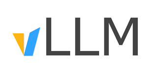

# LLM RL Environments Lil Course

<!--logo-->

A little course on Reinforcement Learning Environments for evaluating and training Language Models.

In this course, we'll use RL to transform a Small Language Model (`LiquidAI/LFM2-2.6B`) into a Tic Tac Toe master that beats `gpt-5-mini`.

<!--add more details? or a section: what will you learn/build?-->

🤗🕹️ [Play against Mr. Tic Tac Toe](https://huggingface.co/spaces/anakin87/LFM2-2.6B-mr-tictactoe)

<!--maybe a screenshot of the game or a short gif-->

## Chapters

1. [Agents, Environments, and LLMs](chapters/01.md): mapping Reinforcement Learning concepts to the LLM domain.
2. [Verifiers](chapters/02.md): an open source library to build RL environments as software artifacts.
3. [Developing a Tic Tac Toe environment with Verifiers](chapters/03.md)
4. [Evaluating existing models with RL environments](chapters/04.md)
5. [Training preparation and synthetic data generation for Supervised Fine-Tuning](chapters/05.md)
6. [Supervised Fine-Tuning warm-up](chapters/06.md)
7. [Reinforcement Learning training to teach our model Tic Tac Toe](chapters/07.md)
8. [Reinforcement Learning pt.2: towards Tic Tac Toe mastery](chapters/08.md)
9. [What did not work: a Tic Tac Toe Post-Mortem from my failed experiments](chapters/09.md)
10. [What we have learned and the future](chapters/10.md)

## Who is this course for?
- **AI Engineers**: You are familiar with classic LLM fine-tuning techniques (Supervised Fine-Tuning) but have little to no experience with Reinforcement Learning.
- **Traditional RL Practitioners**: You know how RL works, but you want to learn how to apply it to Language Models.
- **Curious Tinkerers**: You keep hearing about "reasoning models" and RL post-training, and you want to see how it works under the hood.

## Technologies

*This course is not affiliated with any of the following projects:*

<table width="100%">
  <thead>
    <tr>
      <th>Project</th>
      <th>Description</th>
    </tr>
  </thead>
  <tbody>
    <tr>
      <td align="center">
        <a href="https://github.com/PrimeIntellect-ai/verifiers">
           
          <b>Verifiers</b>
        </a>
      </td>
      <td>An open-source library by Prime Intellect for building RL environments as software artifacts</td>
    </tr>
    <tr>
      <td align="center">
        <a href="https://huggingface.co/LiquidAI">
           
          <b>Liquid AI models</b>
        </a>
      </td>
      <td>Small, fast Language Models based on a novel architecture</td>
    </tr>
    <tr>
      <td align="center">
        <a href="https://github.com/vllm-project/vllm">
           
          <b>vLLM</b>
        </a>
      </td>
      <td>High-throughput and memory-efficient serving engine for LLMs</td>
    </tr>
  </tbody>
</table>

## Course author

Stefano Fiorucci/anakin87
- AI orchestration by day
- Small Language Models post-training, RL tinkering by night

I developed this course based on things I learned over time through practical experience. 
I don't claim perfect theoretical rigor or absolute efficiency. If you spot any errors in this course, please let me know by opening a GitHub issue.

Feel free to follow me on [my social profiles](https://github.com/anakin87)
