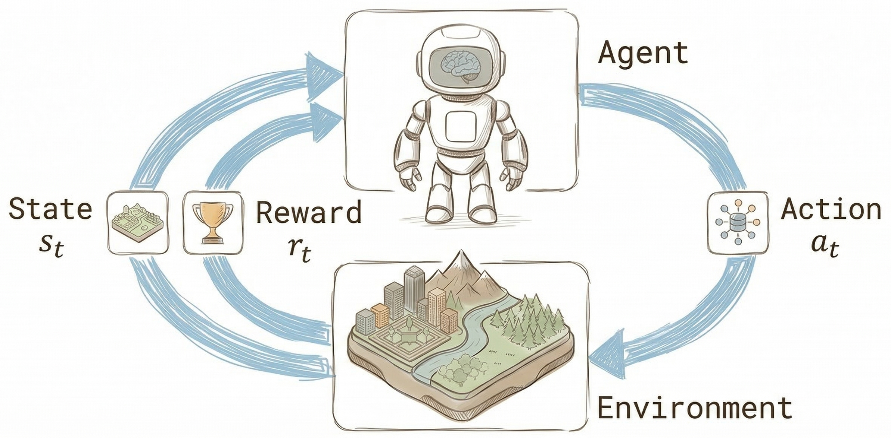
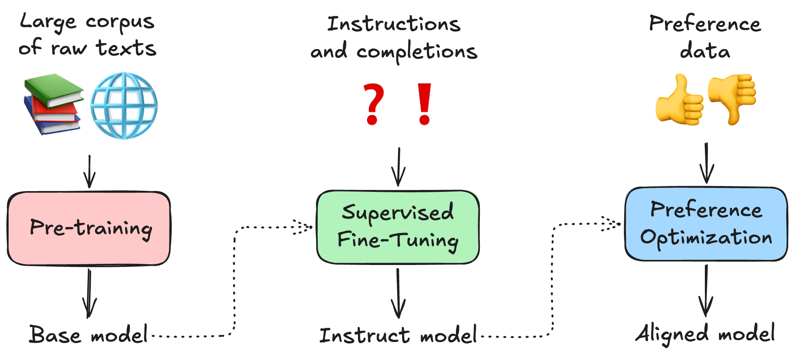
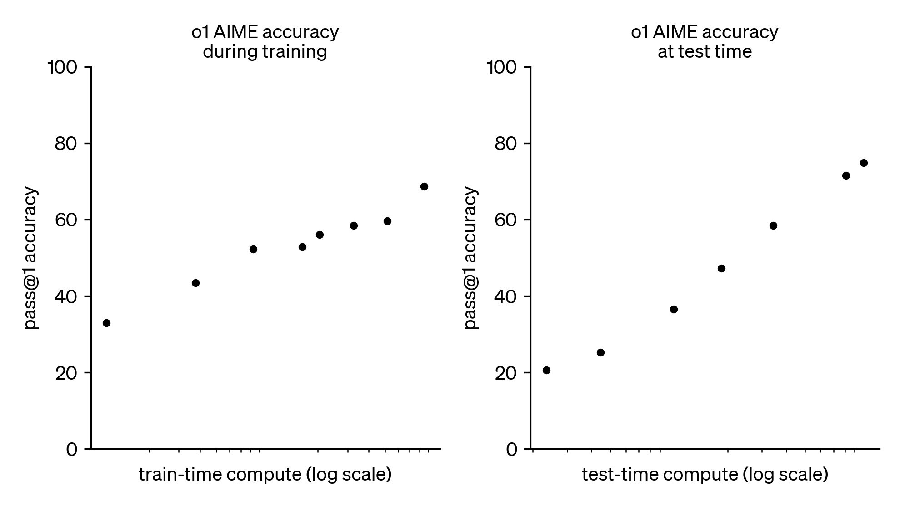
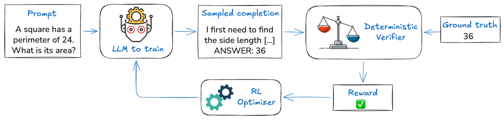

# Agents, Environments, and LLMs

In this chapter, we introduce classic Reinforcement Learning concepts and see how they translate to the domain of Language Models.

## Reinforcement Learning concepts

In Reinforcement Learning, there are two main characters: the **agent** and the **environment**.
The environment is the world the agent interacts with.
At each step, the agent sees the current state of the world and takes an action. The state of the environment then changes in response to that action. The agent also receives a **reward** from the environment: a number indicating how good or bad the current world state is. 

The agent's goal is to maximize its cumulative reward over time. To do this, it must balance exploration (trying new actions to discover better strategies) and exploitation (using actions known to work).

By interacting with the environment, the agent learns from experience and improves its behavior.

A **trajectory** (or **rollout**) is the sequence of states, actions, and rewards that the agent goes through while interacting with the environment. This forms a record of what the agent experienced. While a trajectory can technically be any segment of time, in this course, I use the term to mean a complete episode, which is a run from the start to the end of the task (like one entire game).

## Language Models

A Language Model is a statistical model that, given some text (the prompt), returns a text completion.

Starting from [InstructGPT (2022)](https://openai.com/index/instruction-following/), Reinforcement Learning has played a role in training LMs.

Let's recap the standard training recipe:
- Pre-training on a large amount of internet text; here, the model learns to create text completions.
- Supervised Fine-Tuning on conversational examples to make the model learn new tasks and follow instructions.
- Reinforcement Learning is often used with techniques like PPO to align the model with human preferences.

At some point, this approach started showing its limits: in particular, pre-training did not seem to be able to keep improving model quality
([Ilya Sutskever's talk at NeurIPS 2024](https://www.youtube.com/watch?v=WQQdd6qGxNs)).

Then OpenAI published its o1 models series.

From their ["Learning to reason with LLMs" blog post](https://openai.com/index/learning-to-reason-with-llms/):

> Our large-scale reinforcement learning algorithm teaches the model how to think productively using its chain of thought in a highly data-efficient training process. We have found that the performance of o1 consistently improves with more reinforcement learning (train-time compute) and with more time spent thinking (test-time compute). The constraints on scaling this approach differ substantially from those of LLM pretraining, and we are continuing to investigate them.

Unfortunately, they did not share many details on how this model was trained.

The release of [DeepSeek-R1](https://www.nature.com/articles/s41586-025-09422-z) shed some light on how you can possibly achieve those results.

First, they recognized that reasoning/Chain of Thought can improve the performance of models, but teaching this behavior to models using SFT needs
curated data, which is too expensive to produce at scale.

They used **Reinforcement Learning with Verifiable Rewards**. In this paradigm, the model is asked a question and generates both a reasoning trace and an answer. The answer is then checked against a known correct answer. The reward is used for Reinforcement Learning training.

The underlying idea is more general: any task where the outcome can be verified automatically (a correct answer, a won game, a successful tool call) can serve as a training signal.

This is fundamentally different from SFT. In SFT, the model learns from curated examples, and its completions tend to stay close to the distribution of those examples. In RLVR, the model explores different trajectories from its pre-training and learns to favor the ones that maximize rewards. This is exciting also because the model is no longer limited by the quality of examples
and, by trial and error, it can discover more efficient reasoning strategies.

DeepSeek also used **GRPO**, a new RL algorithm that, compared to techniques like PPO, has a simpler, lighter setup, especially for RLVR.

## Mapping RL concepts to LLMs

Now we can map the classic RL framework onto LLMs. The Language Model acts as the Agent. The environment for any task includes data, harnesses, and scoring rules: everything needed to check and possibly train the model on the task.

From a software perspective, this marks a shift from SFT to RLVR. While SFT mainly relies on conversational datasets, RLVR usually requires an environment: a dynamic system that the model can interact with.

As [Andrej Karpathy puts it](https://x.com/karpathy/status/1960803117689397543), environments
> give the LLM an opportunity to actually interact - take actions, see outcomes, etc. This means you can hope to do a lot better than statistical expert imitation.

The definition of an Agent is also expanding. LMs can now be given tools, from a weather API to a terminal. This makes environments for training and evaluation more complex and critical.

To make this more concrete, consider teaching a Language Model to play Tic Tac Toe, something we'll implement over this course.
- The agent is the Language Model. Its "action" is generating a text response with a specific move.
- The environment acts as the game engine. It handles prompting the model, tracking the board status, generating the opponent's moves, and deciding when the game is over.
- The reward is the signal from the environment (e.g., +1 for a win, 0 for a loss), which guides the model in learning winning strategies through trial and error.

This setup allows the agent to discover strategies that maximize its score without needing pre-existing human examples.

Some of these ideas may feel abstract at first, but they will become clearer once we walk through a concrete environment step by step. See Resources below for details on RL concepts.

## Next up
Now that we've introduced the basic concepts of Reinforcement Learning and how they apply to LLMs, in the [next chapter](02.md), we'll explore Verifiers, a library that makes it easy to build RL environments for training and evaluating Language Models.

## Resources

### Reinforcement Learning

- [Spinning Up in Deep RL](https://spinningup.openai.com/en/latest/index.html): introduction to Deep RL by OpenAI
- [A (Long) Peek into Reinforcement Learning](https://lilianweng.github.io/posts/2018-02-19-rl-overview/) by Lilian Weng

### GRPO, reasoning models, and Reinforcement Learning with Verifiable Rewards

- Deep dive into GRPO: [Hugging Face LLM course](https://huggingface.co/learn/llm-course/en/chapter12/3)
- [Chapter 14 of the RLHF book](https://rlhfbook.com/c/14-reasoning) by Nathan Lambert
- Series of articles by Sebastian Raschka: 
[1](https://sebastianraschka.com/blog/2025/understanding-reasoning-llms.html),
[2](https://sebastianraschka.com/blog/2025/first-look-at-reasoning-from-scratch.html), [3](https://sebastianraschka.com/blog/2025/the-state-of-reinforcement-learning-for-llm-reasoning.html).

---

[Next: Verifiers ➡️](02.md)
