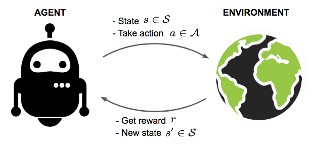
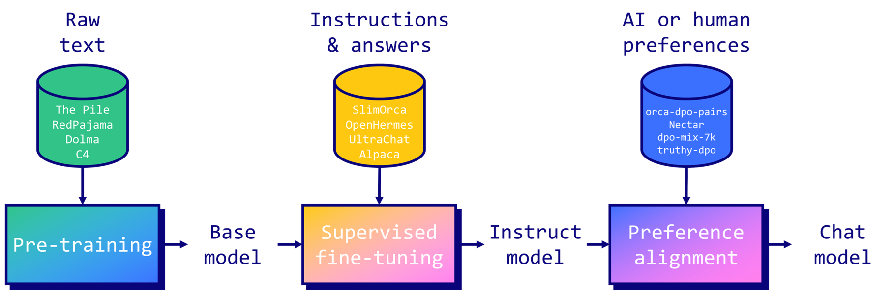
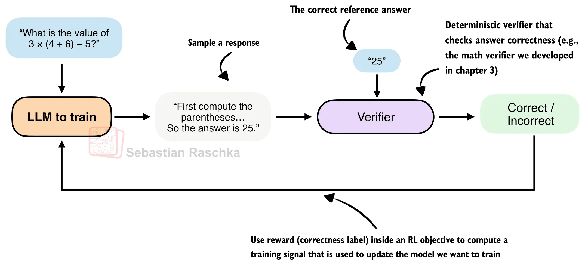

# Agents, Environments, and LLMs

In this chapter, we introduce classic Reinforcement Learning concepts and see how they translate to the domain of Language Models.

## Reinforcement Learning concepts

In Reinforcement Learning, there are two main characters: the **agent** and the **environment**.
The environment is the world the agent interacts with.
At each step, the agent sees the current state of the world and takes an action. The state of the environment then changes based on that action. The agent also receives a **reward** from the environment: a number that tells it how good or bad the current world state is. The goal of the agent is to maximize its cumulative reward over time.

More generally, a **trajectory** (or **rollout**) is the sequence of interactions (states, actions, and rewards) that the agent experiences. While a trajectory can technically be any segment of time, in this course, I use the term to mean a complete episode: a run from the start until the game ends.

## Language Models

A Language Model is a statistical model that, given some text (the prompt), returns a text completion.

Starting from [InstructGPT (2022)](https://openai.com/index/instruction-following/), Reinforcement Learning has played a role in training LMs.

Let's recap the standard training recipe:
- Pretraining on a large amount of internet text; here the model learns to create text completions.
- Supervised Fine-Tuning on conversational examples to make the model learn new tasks and follow instructions.
- Reinforcement Learning is often used with techniques like PPO to align the model with human preferences.

The release of [DeepSeek-R1](https://www.nature.com/articles/s41586-025-09422-z) brought renewed attention to RL in LLMs and popularized the use of **Reinforcement Learning with Verifiable Rewards** at scale. In this setup, the model is asked a question and generates a reasoning trace and an answer, which is then evaluated against a known ground truth.

This is fundamentally different from SFT. In SFT, the model learns from curated examples, and its completions tend to stay close to the distribution of those examples. In RLVR, the model explores different trajectories from its pretraining and learns to favor the ones that maximize rewards.

DeepSeek also used **GRPO**, a new RL algorithm that, compared to techniques like PPO, has a simpler and more lightweight setup, especially for RLVR.

## Mapping RL concepts to LLMs

We can now map the classic RL framework directly onto LLMs. The Language Model plays the role of the Agent; the environment for a given task consists of data, harnesses and scoring rules: everything needed to evaluate and potentially train the model on that task.

From a software perspective, this marks a shift from SFT to RLVR. While SFT mainly relies on conversational datasets, RLVR usually requires an environment: a dynamic system that the model can interact with.

As [Andrej Karpathy puts it](https://x.com/karpathy/status/1960803117689397543), environments
> give the LLM an opportunity to actually interact - take actions, see outcomes, etc. This means you can hope to do a lot better than statistical expert imitation.

The definition of an Agent is also expanding. LMs can now be given tools, from a weather API to a terminal. This makes environments for training and evaluation more complex and critical.

To make this more concrete, consider teaching a Language Model to play Tic Tac Toe, something we'll implement over this course.
- The agent is the Language Model. Its "action" is generating a text response with a specific move.
- The environment acts as the game engine. It handles prompting the model, tracking the board status, generating the opponent's moves, and deciding when the game is over.
- The reward is the signal returned by the environment (e.g., +1 for a win, 0 for a loss), which guides the model to learn winning strategies through trial and error.

This setup allows the agent to discover strategies that maximize its score without needing pre-existing human examples.

Some of these ideas may feel abstract at first, but they will become clearer once we walk through a concrete environment step by step. For more detailed information on RL concepts, check out the Resources section below.

## Next up
Now that we introduced the basic concepts of Reinforcement Learning and how they apply to LLMs, in the next chapter, we'll discover Verifiers, a library that makes it easy to build RL environments for training and evaluating Language Models.

## Resources

### Reinforcement Learning

- [Spinning Up in Deep RL](https://spinningup.openai.com/en/latest/index.html): introduction to Deep RL by OpenAI
- [A (Long) Peek into Reinforcement Learning](https://lilianweng.github.io/posts/2018-02-19-rl-overview/) by Lilian Weng

### GRPO, reasoning models, and Reinforcement Learning with Verifiable Rewards

- Deep dive into GRPO: [Hugging Face LLM course](https://huggingface.co/learn/llm-course/en/chapter12/3)
- [Chapter 14 of the RLHF book](https://rlhfbook.com/c/14-reasoning) by Nathan Lambert
- Series of articles by Sebastian Raschka: 
[1](https://sebastianraschka.com/blog/2025/understanding-reasoning-llms.html),
[2](https://sebastianraschka.com/blog/2025/first-look-at-reasoning-from-scratch.html), [3](https://sebastianraschka.com/blog/2025/the-state-of-reinforcement-learning-for-llm-reasoning.html).