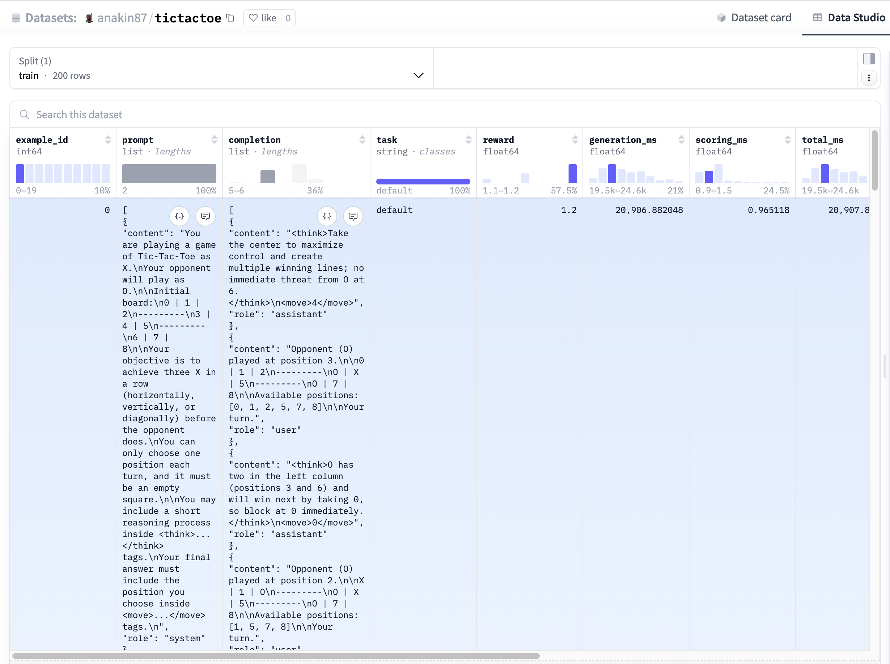

# Training preparation and synthetic data generation

In the previous chapter, we used our Tic Tac Toe environment to evaluate `openai/gpt-5-mini`, and `LiquidAI/LFM2-2.6B`.
We saw that neither is a perfect player, but there is a significant gap in favor of the OpenAI model.

Now we'll structure our training process and do the first steps. But first, let's spend a few words on the model we will be training.

## `LiquidAI/LFM2-2.6B` model

In this course, we focus on making `LiquidAI/LFM2-2.6B` a competent Tic Tac Toe player by training it on this task.

Why choose this model?
- It's a very good model for its size (see the [LFM2 Technical Report](https://arxiv.org/abs/2511.23404) for evaluation on a wide range of benchmarks).
- Smaller models (especially under 1.5B parameters) might struggle to learn the game properly.
- It is an instruct model, ideal for transforming it into a reasoning model for this task.
- As recommended in the [Verifiers docs](https://docs.primeintellect.ai/verifiers/training#rl-rules-of-thumb), the model has 
  a reward >0, meaning RL has a signal to amplify.
- Manually inspecting the generated text reveals some promising capabilities.

I'll share more insights from failed attempts later. For now, trust me but know that this workflow adapts easily to other open models.

## Training overview

In the last chapter, we saw that `LiquidAI/LFM2-2.6B` follows format less than 30% of the time and provides
invalid moves in ~40% of the games. If we jump straight to RL, some training time would be dedicated to just teaching the
format. This is acceptable, but we can speed things up with a **Supervised Fine-Tuning warm-up**.

The goal of this phase is simply to have the model learn the format and valid move syntax.

So our training process can look like this:
1. Synthetic data generation for Supervised Fine Tuning
2. Supervised Fine Tuning
3. (One or more phases of) Group-based Reinforcement Learning

Let's start!

## Synthetic data generation for Supervised Fine Tuning

In Supervised Fine Tuning, Language Models are trained using explicit prompt-completion pairs that represent the desired behavior.

To know more about SFT, check out the [Hugging Face course](https://huggingface.co/learn/llm-course/en/chapter11/3).

To teach our small model the format, a few hundred examples will be sufficient, but we don't want to write them
down manually.

Since `openai/gpt-5-mini` followed format perfectly (and played decently), we can use it to generate our data.

Thanks to the Verifiers evaluation command, generating this data is very convenient.

Assuming that the environment is installed (see the last chapter for instructions), we can generate 200 examples with opponents
of different skills:
```bash
prime eval run tictactoe -m openai/gpt-5-mini -n 200 -r 1 --save-to-hf-hub --hf-hub-dataset-name anakin87/tictactoe
```

This will push the dataset to the Hugging Face Hub. You can inspect my generated data [here](https://huggingface.co/datasets/anakin87/tictactoe).



It is a good idea to inspect the dataset to ensure it is as expected. Fun fact: in a previous attempt, `gpt-5-mini`
repeatedly included in the reasoning part sentences like "I cannot share my internal chain of thought, but this is a
short recap:...". I haven't had a look at the data, but the trained model showed the same behavior, and I figured it out...

## Filtering data

As expected, inspecting our dataset reveals some games where the model loses.

While our primary goal is to teach format, training on `openai/gpt-5-mini`'s losing games might bake in suboptimal strategies. We can easily filter our dataset to keep only wins and draws.

First, install `datasets`

```bash
pip install datasets
```

Then run the following code:

```python
from datasets import load_dataset

ds = load_dataset("anakin87/tictactoe")

ds = ds.filter(lambda x: x["win_reward_func"] > 0 and x["format_reward_func"] == 1)

ds.push_to_hub("anakin87/tictactoe-filtered")
```

The filtered dataset is available [here](anakin87/tictactoe-filtered) and contains 174 examples.

## Counting tokens for `seq_len`

An important parameter in Supervised Fine Tuning is maximum sequence length: longer examples will be truncated,
potentially losing some information. Conversely, setting it too high wastes GPU memory.

Let's compute the actual conversation lengths.

First, install the libraries we need

```bash
pip install datasets numpy transformers
```

Then execute this code:
```python
from transformers import AutoTokenizer
from datasets import load_dataset
import numpy as np
import multiprocessing

tokenizer = AutoTokenizer.from_pretrained("LiquidAI/LFM2-2.6B", use_fast=True)
dataset = load_dataset("anakin87/tictactoe-filtered")

def conversation_length(batch):
    conv_lengths = []
    for prompt_msgs, completion_msgs in zip(batch["prompt"], batch["completion"]):
        conversation = prompt_msgs + completion_msgs

        tokenized_conversation_ids = tokenizer.apply_chat_template(
            conversation,
            tokenize=True,
            add_special_tokens=True
        )
        total_tokens = len(tokenized_conversation_ids)
        conv_lengths.append(total_tokens)
    return {"conv_length": conv_lengths}

dataset = dataset.map(
    conversation_length,
    batched=True,
    batch_size=256,
    num_proc=multiprocessing.cpu_count(),
    remove_columns=dataset["train"].column_names
)

conv_lengths = np.array(dataset["train"]["conv_length"])
max_length = max(conv_lengths)
print(f"The maximum conversation length is: {max_length} tokens")

chosen_length = 700
percentile = (conv_lengths <= chosen_length).mean() * 100
print(f"{percentile:.2f}% of conversations fit within {chosen_length} tokens")

# Output
# The maximum conversation length is: 711 tokens
# 98.28% of conversations fit within 700 tokens
```

In general, it's acceptable to truncate some examples to save memory, but it is better to be aware of it and measure
what portion of your data will get truncated.

In this case, the maximum conversation length is 711 tokens. Setting `seq_len` to 700 would preserve over 98%
of full examples, which is an acceptable trade-off.


## Next up

In this chapter, we structured our training and saw how easy it is to generate synthetic data using a Verifiers environment with a strong model. Now everything is ready to start training!