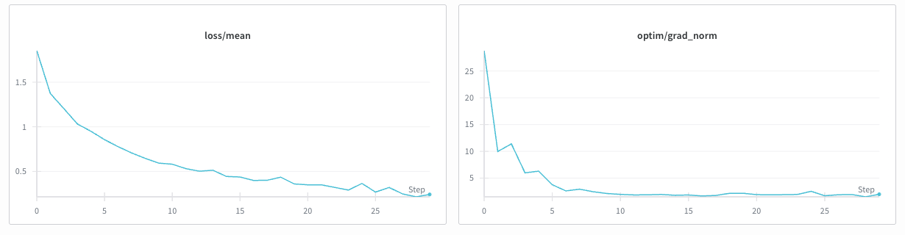

# Supervised Fine-Tuning warm-up

In the [previous chapter](05.md), we saw that before applying Reinforcement Learning, it is a good idea to start
with a quick Supervised Fine-Tuning warm-up phase to teach `LiquidAI/LFM2-2.6B`. We generated
~200 examples using `openai/gpt-5-mini` for this purpose.

Now we will perform the actual SFT training.

## SFT with PRIME-RL

Verifiers provides a simple RL trainer, but it's not designed for Supervised Fine-Tuning.

So, to proceed with training, there are several options. In this course, we use [PRIME-RL](https://docs.primeintellect.ai/prime-rl), a framework for large-scale asynchronous reinforcement learning that also offers SFT
training. As we will see, it is quite easy to set up a quick SFT run.

Another good option for SFT is [Hugging Face's TRL](https://huggingface.co/docs/trl), with its [SFT Trainer](https://huggingface.co/docs/trl/en/sft_trainer).

For training, you'll need a machine with a GPU.
You can easily spin one up on [Prime Intellect](https://app.primeintellect.ai/dashboard/on-demand-gpus).

I used an NVIDIA RTX Pro 6000 96GB, but you can use smaller GPUs by lowering `batch_size`. Since this SFT warm-up requires just a few minutes, the GPU cost is negligible.

Once we have our machine, we can install PRIME-RL:
```bash
curl -sSL https://raw.githubusercontent.com/PrimeIntellect-ai/prime-rl/main/scripts/install.sh | bash
cd prime-rl
```

If you need W&B support (for logging training runs) and Hugging Face support (for saving the model), run:

```bash
uv run wandb login
uv run hf auth login
```

It's time to create a configuration file for PRIME-RL. Create a file named `primerl_sft.toml` with the following content (also available [here](../training_configs/primerl_sft.toml)):

```toml
max_steps = 30

[ckpt] # Checkpoint at the end of training

[model]
name = "LiquidAI/LFM2-2.6B"

[data]
name = "anakin87/tictactoe-filtered"
seq_len = 700
batch_size = 32

[optim]
lr = 1e-5
```

This configuration is quite intuitive.

`seq_len` respects the token count we calculated in the [last chapter](05.md) and ensures that most of our examples are not truncated.

We are training the model for 30 steps, with a batch size of 32. The model will see 960 examples total. Since our cleaned dataset has 174 examples, this means roughly 5.5 epochs. There might be some risk of memorization, but we don't care much here: we want the model here to learn the format; actual gameplay will be learned during RL, which will reshape our model if needed.

Once the configuration file is created (`primerl_sft.toml`), we launch a tmux session to control our training:
```bash
bash scripts/tmux.sh
```

Then, in the "Trainer" pane, start training:
```
uv run sft @ primerl_sft.toml
```

At the end of the training (less than 5 minutes on an RTX 6000), push the model to Hugging Face:
```bash
uv run hf upload anakin87/LFM2-2.6B-ttt-sft outputs/weights/step_30
```

The final model is available [here](https://huggingface.co/anakin87/LFM2-2.6B-ttt-sft).

For more details about PRIME-RL, I recommend checking their [examples](https://github.com/PrimeIntellect-ai/prime-rl/tree/main/examples).



The training plots look OK. If you are curious about more details, you can explore the "SFT" run in this [W&B project](https://wandb.ai/stefanofiorucci/LFM2-2.6B%20Tic%20Tac%20Toe/table).

## Evaluation

We are now curious to see whether SFT achieved the goal of improving response format.

For evaluation, we need a GPU to run the model with vLLM. For preparation, we repeat the steps described in 
[Chapter 4](04.md).

```bash
curl -LsSf https://astral.sh/uv/install.sh | sh
uv venv
source .venv/bin/activate
uv tool install prime && uv tool update-shell
prime env install anakin87/tictactoe
uv pip install vllm
vllm serve anakin87/LFM2-2.6B-ttt-sft
```

We can now run evaluation using the `prime eval` command from Verifiers.
We point `--api-base-url` to our local vLLM server and set `--api-key-var` to a placeholder key.


### Against a random opponent

Let's first evaluate 100 different matches against a random opponent

```bash
prime eval run tictactoe -n 100 -r 1 -m anakin87/LFM2-2.6B-ttt-sft --api-base-url http://localhost:8000/v1 --api-key-var PLACEHOLDER_API_KEY -a '{"min_random_move_prob": 1.0, "max_random_move_prob": 1.0}'
```

Output:
```
Rewards:
reward: avg - 0.994, std - 0.356
win_reward_func: avg - 0.805, std - 0.353
format_reward_func: avg - 0.998, std - 0.025
invalid_move_penalty_func: avg - -0.011, std - 0.031
num_turns: avg - 3.700, std - 0.866

Info:
is_truncated: avg - 0.000, std - 0.000
stop_conditions: has_final_env_response: 1.000

Timing:
generation: min - 2s, mean - 3s, max - 4s
...
```

### Against an optimal opponent

Now let's evaluate the same model against the optimal opponent:
```bash
prime eval run tictactoe -n 100 -r 1 -m anakin87/LFM2-2.6B-ttt-sft --api-base-url http://localhost:8000/v1 --api-key-var PLACEHOLDER_API_KEY -a '{"min_random_move_prob": 0.0, "max_random_move_prob": 0.0}'
```

Output:
```
reward: avg - 0.444, std - 0.252
win_reward_func: avg - 0.260, std - 0.250
format_reward_func: avg - 0.990, std - 0.099
invalid_move_penalty_func: avg - -0.014, std - 0.035
num_turns: avg - 3.910, std - 0.960

Info:
is_truncated: avg - 0.000, std - 0.000
stop_conditions: has_final_env_response: 1.000

Timing:
generation: min - 4s, mean - 7s, max - 9s
...
```

Let's visualize the improvement:

| **Model vs random opponent**  | **% Wins** | **% Draws** | **% Losses** | **% Follows format** | **% Games w invalid moves** |
|-------------------------------|------------|-------------|--------------|----------------------|-----------------------------|
| LiquidAI/LFM2-2.6B            | 40         | 11          | 49           | 27.8                 | 40                          |
| anakin87/LFM2-2.6B-ttt-sft    | 74         | 13          | 13           | 99.8                 | 11                          |
|                               |            |             |              |                      |                             |
| **Model vs optimal opponent** | **% Wins** | **% Draws** | **% Losses** | **% Follows format** | **% Games w invalid moves** |
| LiquidAI/LFM2-2.6B            | 0          | 11          | 89           | 24.7                 | 43                          |
| anakin87/LFM2-2.6B-ttt-sft    | 0          | 52          | 48           | 99                   | 14                          |

We can be really satisfied with the SFT warm-up:
- **Format following** jumped from <30% to 99%
- **Games with invalid moves** dropped from >24% to ~14%


Although gameplay strategy wasn't the primary goal, using the correct format improved performance. The model now wins frequently against a random opponent and manages to draw against the optimal opponent roughly half the time.

## Next up
There is still significant work to do to make our small model an excellent player, but that is a job for Reinforcement Learning. Go to the [next chapter](07.md) to see it in action!
